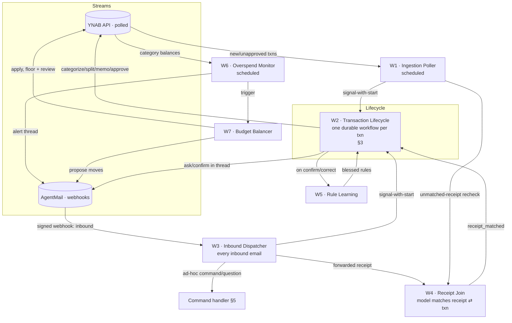
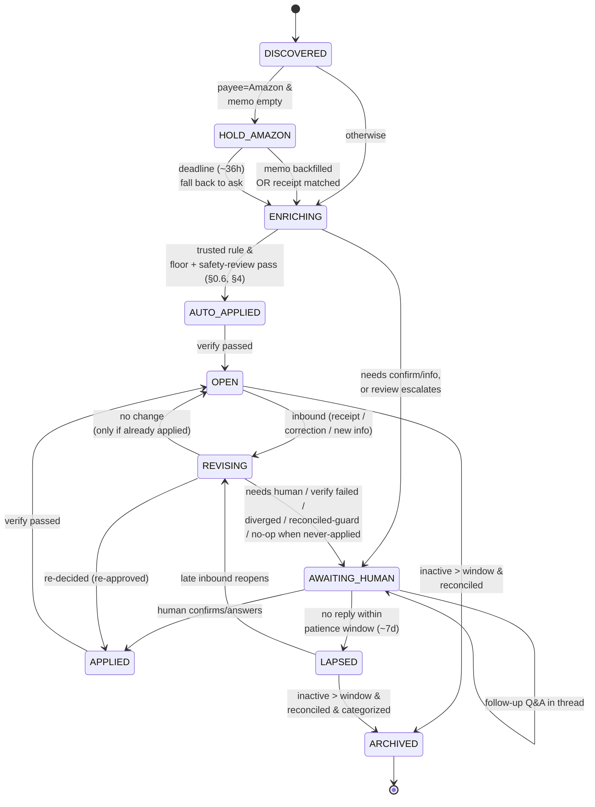
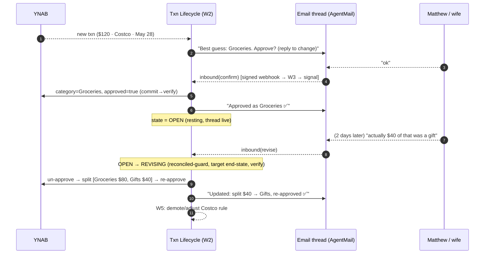
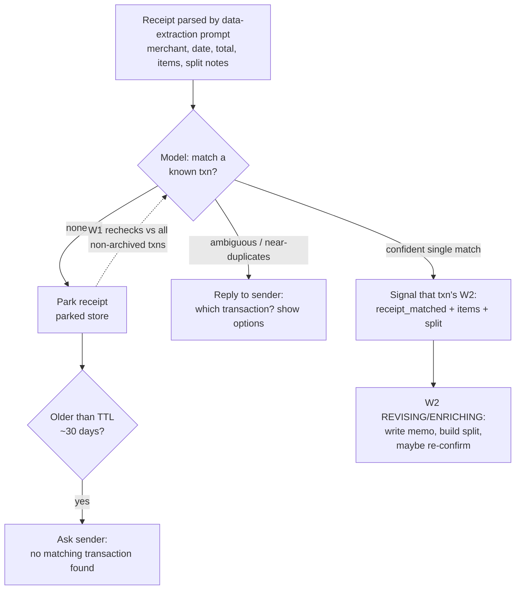

# YNAB Agent Flow Spec

> An AI agent that triages, categorizes, splits, memos, and approves YNAB transactions (and
> optionally balances budgets), driven by per-transaction email threads with Matthew & wife.
> Runtime: Pydantic AI on Temporal (durable agent loop, model-agnostic). Email: AgentMail.

---

## 0. Design principles

1. **Ramp from cautious.** Start by confirming almost everything. Autonomy is earned per-payee as
   confirmations accumulate. No global "trust the model" switch.
2. **Per-transaction threads.** Every transaction needing input gets its own email thread. Either
   spouse can reply anytime.
3. **Decisions are never final.** A reply landing after a transaction is categorized or approved
   can reopen and rewrite it. A correction is the highest-signal event in the system.
4. **Two async streams that must join.** Transactions (YNAB) and receipts (email) arrive
   independently, in either order. The join is first-class.
5. **Wait, don't race, on Amazon.** Blank Amazon transactions are expected; a daily sync backfills
   item memos. Hold them until detail arrives or a deadline passes.
6. **Rules, not raw model confidence, authorize auto-approval.** Each confirmation/correction
   nudges a tiny payee→action rule. A human-blessed rule grants autonomy; confidence only shapes
   wording.
7. **Silence is not consent.** If no one answers within the patience window, the agent hands the
   transaction back for manual handling. It never guesses-and-applies.
8. **A thin floor, then trust the model.** A small deterministic floor bounds catastrophe (caps,
   circuit breaker, idempotency). Above it, the model interprets replies, matches receipts, judges
   anomalies, and asks when unsure. Don't reimplement what a capable model does reliably.
9. **KISS.** Few entities, few states. Don't add complexity that becomes its own failure mode.

---

## 0.5 Architecture: deterministic spine vs. agentic middle

Both YNAB and email are reached as MCP tools; the model uses them flexibly (prompt engineering,
not hardcoded API logic). The seam is **who chooses the call**:

- **Agentic middle:** the model calls MCP tools with arguments it reasoned out.
- **Deterministic spine:** workflow code calls MCP tools/activities with computed arguments, at a
  time it decided, then verifies.

### Division of labor

| Model owns | Workflow owns |
|---|---|
| What the category / split / memo is | When to act, and whether it already happened |
| Parsing receipts, classifying email, fuzzy receipt⇄txn matching | Lifecycle state + idempotency (approve once; don't re-email) |
| Interpreting free-text replies; asking a clarifying question when unsure | Timers: Amazon hold, patience window, archive window |
| Proposing a write (category, split, budget move) | Committing + verifying it; the autonomy gate (§4.2) |
| The agent-powered safety review (§0.6), which can only escalate | The hard floor (§0.6): caps & circuit breaker no model overrides |

The model owns *what*, *how-worded*, and *is-this-anomalous*; the workflow owns *when*,
*did-it-happen*, and the floor that never moves.

### Runtime & the durable loop

**Pydantic AI on Temporal.** `agent.run()` executes inside the Temporal workflow, so the
reasoning/tool loop replays deterministically on recovery, not just isolated tool calls. Each LLM
inference and MCP/tool call is a Temporal activity whose result is recorded in event history; on
restart the loop re-derives its path from history without re-calling the model or re-spending
tokens.

Determinism constraints (the footgun): workflow code does pure state + Temporal API calls only.
Clocks via `workflow.now()`, ids via `workflow.uuid4()` or derived from `ynab_id`. Never branch
loop control on a non-recorded value. Pydantic AI covers the agent's nondeterminism; author glue
(timers, idempotency keys, audit-log timestamps) is the operator's responsibility.

Long-lived workflows: a W2 can live 30-45 days. `continue-as-new` only from a stable resting
state, store deadlines as absolute timestamps (not durations), drain pending signals before
continuing, carry only a pointer to the externalized `audit_log`. The agent `name` and every
toolset `id` must be frozen after deploy, or in-flight workflows break on replay.

Lighter alternative: Pydantic AI also has a DBOS backend (Postgres-only, no cluster) with the same
durable-loop semantics. Temporal is chosen for native signals/timers/continue-as-new, which map
directly onto this design; switching cost is low.

### Model strategy (Gemma primary, Claude fallback, per-task)

- **Provider-agnostic.** Models are referenced by name and pre-registered on the agent (Temporal
  can't serialize ad-hoc instances): `models = { fast: OpenAIChatModel('gemma-4-31b',
  base_url='http://mac-studio.tailnet:11434/v1'), reasoning: 'anthropic:claude-...' }`. Swapping or
  adding a provider is a config change.
- **Routing.** Gemma 4 31B (self-hosted on the Mac Studio over Tailscale) for cheap, high-volume,
  low-stakes steps: first-pass classification, drafting email prose. Claude (the `reasoning` /
  fallback model) for safety-critical steps: interpreting replies, proposing the YNAB write, the
  safety review (§0.6). `FallbackModel` escalates a Gemma failure to Claude.
- **Why Claude drives writes.** Gemma 4 benchmarks well (top-tier open-weight, native
  function-calling) but tends to under-call tools and is self-hosted without a frontier API's
  hardening, so it doesn't solely drive irreversible money writes.
- **Two spikes before relying on this:** (1) confirm `FallbackModel` serializes under
  `TemporalAgent` (arbitrary instances can't serialize for replay; pre-register members by name);
  (2) confirm Gemma 4 returns real `content` over Ollama's OpenAI-compatible `/v1` (Ollama bug
  #15288 routes Gemma 4 text into the `reasoning` field; MLX, native `/api/chat`, or a newer build
  may be needed).
- **Model-quality guardrails (any model).** Validate tool names & arguments before executing
  (malformed tool calls happen even at the frontier); keep ≤3 parallel tool calls; enforce
  schema-valid JSON via structured output.

### MCP rules of engagement

1. **MCP calls run as activities** (Pydantic AI auto-wraps model/tool/MCP calls), so neither the
   model's nor the spine's calls run in workflow code directly.
2. **Reads are free; writes go propose → commit → verify.** The model proposes; a deterministic
   activity commits; a read-after-write confirms the full intended end-state field-by-field (incl.
   per-subtransaction) before the state machine advances. Never trust a write tool's prose echo.
3. **Normalize loose results.** Each spine-critical call gets a thin (~10-line) adapter answering
   "did it work? what's the new state?" Normalization, not rebuilding the API.
4. **MCP-first; direct API only for gaps.** Likely gap: a YNAB delta/cursor sync for efficient
   polling (W1). Per-gap fallback, never wholesale reimplementation.

### Configured servers

- **`agentmail`** (project-level, `.mcp.json`): inboxes, native threading, auto-generated
  SPF/DKIM/DMARC (no DNS work on `@agentmail.to`; a one-time DNS-record paste on a custom domain),
  attachments, labels (string tags via API; no built-in auto-labeling, so the agent
  classifies-then-labels), inbound webhooks/websockets with signing (Svix). Email is event-driven,
  not polled.
- **YNAB MCP** (user-level): the runtime wires its own client to the same server. YNAB has no
  webhooks, so YNAB alone is polled (W1).

---

## 0.6 Safety model

Two layers plus a lean inbound boundary: a smart layer that expands the set of payees worth
automating, on a dumb layer that catches disasters regardless of model.

### Layer 1: hard floor (deterministic, uninvadeable)

Absolute limits enforced by spine code before any commit, independent of the model (a runaway
poller, a prompt injection, or a model meltdown must not get past them):

1. **Per-transaction auto-write ceiling.** Above a configured amount, a txn always drops to
   `AWAITING_HUMAN` regardless of trust.
2. **Per-run / per-day circuit breaker.** A cap on auto-actions per polling run and per day.
   Tripping it pauses autonomy and fires an out-of-band alert (§13).
3. **Never act on an unreadable amount.**

### Layer 2: agent-powered safety review

Before an *anomalous* auto-apply (and before any auto budget-move), a Claude step reviews the
action in context (payee history, typical amounts, reply ambiguity, receipt corroboration) and
returns `{ proceed | escalate_to_human, reason }`.

- **By exception, not every txn.** A clean, recurring, in-range match on a trusted rule auto-applies
  on floor + rule alone. The review fires only when something is off (amount/timing anomaly, a new
  merchant, an ambiguous reply). This keeps the rare "escalate" meaningful and keeps cost down.
- **One-way ratchet.** The review can only hold back (force a human) or stay within the blessed
  grant. It never expands autonomy beyond what a human/rule blessed (principle 6). Model judgment is
  additive safety, not a path to spend money.
- **Effect.** Because the smart layer catches the weird $2,000 charge at the $12 coffee shop, more
  payees can run at L2; the hard floor bounds the blast radius if the review is wrong.

### Inbound boundary

- **Authenticity.** Trust AgentMail's signed webhooks for provenance; act on write/command verbs
  only from allow-listed senders; use AgentMail's inbound auth/spam signals if exposed; prefer
  write-verbs on agent-originated threads. We don't reimplement DKIM/SPF verification.
- **Read-back on high-impact verbs.** For standing `always/never` rules, budget moves, and trust
  elevation, the model echoes its interpretation and asks for a one-word confirm.
- **Untrusted content vs. trusted commands.** A data-extraction prompt turns receipt/email content
  into structured fields, kept separate from the command-interpretation prompt (which acts only on a
  verified sender's reply). Content surfaces facts but cannot issue commands, change trust, or
  trigger budget moves.
- **No write on an ambiguous parse.** If unsure it understood a reply, the agent asks rather than
  guessing.
- **Fail-closed scope.** v1 targets exactly one named YNAB budget (optionally a subset of accounts).
  W1 filters before starting any W2.

### Optional bake-in mode

A single spine flag: SHADOW (propose + verify-read, skip commit; emails say "I would have
categorized this as Dining") then LIVE (normal §4 ladder). Runs the system end-to-end against the
real budget before it writes. Nearly free; recommended (§11).

---

## 1. Core entities

| Entity | What it is | Lifetime |
|---|---|---|
| **Transaction** | The unit of work, one per YNAB transaction. Carries proposal, decision, thread link, audit log. | Long-lived (budget period + grace window, then archived; late edits reopen). |
| **Thread** | 1:1 with a transaction. The AgentMail conversation. Both spouses on it. | Same as its transaction. |
| **Receipt** | A forwarded email/photo with merchant, date, total, line items, optional split notes. | Parked until matched; TTL if never matched. |
| **Rule** | `match → action` with a trust state. The memory that improves the flow. | Persistent. |
| **Proposal** | Current best guess: `{category\|split, memo, confidence, rationale}`. | Recomputed on every signal. |

### Transaction record
```
txn {
  ynab_id, account, payee, amount, date, posted_at
  memo, flag, cleared, reconciled        # reconciliation state (§3 guard)
  import_id, matched_transaction_id      # YNAB import-lifecycle (§3, §13)
  state                                  # §3
  proposal {category|split[], memo, confidence, rationale, sources[]}
  decision {category|split[], memo, approved, decided_by, decided_at}
  thread_id                              # AgentMail thread (authoritative)
  receipt_ids[]
  rule_id                                # rule that drove the decision (null = pure-human)
  audit_log[]                            # append-only; externalized, pointer carried
}
```

### Rule
```
rule {
  id
  match  { payee_pattern, account?, amount_range?, item_keyword? }
  action {
    category
    | split[ { share: percent|fixed_amount, category, memo_template?, person_tag? } ]
    memo_template?
  }
  trust  # suggested -> confirmed -> trusted (§4.2)
  hits, last_confirmed_at, last_corrected_at
  source # "human_explicit" | "learned"
}
```
Lookup is by payee plus optional conditions. When several rules match, the spine doesn't rank them;
it asks one question: does exactly one trusted/blessed rule clearly apply? If yes, that rule may
gate autonomy. If it's ambiguous (conflicting trusted rules, or none clearly applies), the txn goes
to ASK. The model still uses all matching rules as signals when proposing; the spine only governs
whether the proposal may auto-apply. Split shares: fixed lines are subtracted first, then the
remainder distributes across percent lines, so "$40 Gifts, rest Groceries" and "50/50" both encode
deterministically.

---

## 2. The workflow map

Seven components: three spine (ingest → lifecycle → email front door) and four optional modules.
Not all are long-lived workflows; classifying them keeps the durability boundary explicit (and
collapses several into simple functions).

| Component | Temporal primitive | Notes |
|---|---|---|
| W1 · Ingestion Poller | Schedule → short workflow/activity | YNAB has no webhooks; poll the delta. |
| W2 · Transaction Lifecycle | Long-lived Workflow (one per `ynab_id`) | The core. §3. |
| W3 · Inbound Dispatcher | Activity/handler off an AgentMail webhook | Email is push. §5. |
| W4 · Receipt Join | Activity/handler (model-driven match) | §6. |
| W5 · Rule Learning | Activity/handler | §9. |
| W6 · Overspend Monitor | Schedule → short workflow | Notify-only v1. §7. |
| W7 · Budget Balancer | Workflow/activity | Propose-then-confirm. §8. |



### Responsibilities

- **W1** (scheduled, ~1-3h): poll the YNAB `transactions` delta (server_knowledge cursor). For each
  new/unapproved in-scope txn, address its W2 by `ynab_id` via signal-with-start (starts if absent,
  signals if present; no check-then-act race). Also recheck parked receipts against new
  transactions, notice an Amazon memo backfill and signal its W2, and handle cold-start +
  import-lifecycle (§13, §3).
- **W2**: the core lifecycle. §3.
- **W3**: fired by an AgentMail signed webhook on every inbound message. Verify, classify, route. §5.
- **W4**: the model finds a receipt's transaction or parks it. §6.
- **W5**: turn confirmations/corrections into rules; adjust trust. §9.
- **W6** (scheduled daily): project category spend; alert. §7.
- **W7**: propose/apply reallocations under floor + review. §8.

---

## 3. Transaction lifecycle (W2)

A transaction is a small state machine. External input collapses to two signals (`inbound(payload)`
from W3/W4, and the Amazon `memo_present` check) plus timers. Two defining properties: `OPEN` is a
resting state, not terminal (an `inbound` there triggers a full revision), and silence ends in
`LAPSED`, not a guess (the agent hands the txn back rather than auto-applying on timeout).



### State notes

- **Addressing & init.** A W2 is addressed only by a deterministic workflow id derived from
  `ynab_id`, always via signal-with-start. It must tolerate being born from a signal (a
  receipt/reply can reference a txn W1 hasn't polled yet): start in `DISCOVERED`, fetch the YNAB
  snapshot, then drain buffered signals. If the snapshot isn't in YNAB yet (signal beat the poll),
  retain the buffered signals and stay in `DISCOVERED` until W1 materializes it. The AgentMail
  `thread_id` (plus the opaque `txn_id` subject tag) links thread↔txn.
- **DISCOVERED.** Snapshot the txn (incl. `cleared/reconciled`, `import_id`); open the audit log.
- **HOLD_AMAZON.** Payee is Amazon-ish and memo empty. Set a ~36h deadline; exit early if a receipt
  matches or the memo backfills. On deadline, enrich and ask ("Amazon $X on May 28, no item detail
  synced. What was this?").
- **ENRICHING.** Assemble the proposal from signal sources (§4.1); route via the autonomy gate
  (§4.2). Auto-apply only through floor + safety review (§0.6).
- **AUTO_APPLIED.** Write category/split + memo, set `approved=true`, post a low-key FYI
  ("Auto-categorized as Dining via your standing rule; reply to change."). Reversible via OPEN.
- **AWAITING_HUMAN.** The default early state. Email a proposal or question on the thread and park on
  `inbound`. Threads volley freely (ask, answer, clarify). A patience timer (~7d, configurable) runs.
- **APPLIED.** Category/split/memo written and `approved=true`, decided/confirmed by a human. Confirm
  in-thread only after verify passes.
- **OPEN.** Resting state. Thread stays live. Any `inbound` → REVISING.
- **LAPSED.** Patience window expired with no answer. The agent posts a hand-off note ("Haven't heard
  back; leaving this one for you to handle in YNAB.") and stops nagging. It does not apply a guess. A
  late reply reopens it (→ REVISING). Archiving a LAPSED txn requires it to be categorized (not merely
  reconciled, since YNAB allows reconciling an uncategorized txn); if the archive window passes while
  it's still uncategorized, the agent sends "archiving uncategorized $X · Payee; confirm you handled
  it" rather than going silent, and the §13 sweep tracks it until then.
- **REVISING.** The safe-revision procedure (the signature feature and the riskiest path, since it
  mutates approved money records). One converge-to-target runs at a time; newest instruction wins:
  1. Re-drain to the newest signal on entry and after each verify, then recompute a single target
     end-state. A mid-cycle correction just changes the next target; a needless intermediate write is
     skipped when the buffer already holds its successor.
  2. Reconciliation guard: if the txn is reconciled or in a closed month, don't silently
     un-approve/edit. Propose to the human; prefer an additive correction.
  3. Commit = converge to target. Read current YNAB state; if it equals the target (`content_hash`
     match), do nothing; else write category/split and `approved` together where the MCP supports it.
     Dedup on `(ynab_id, content_hash)` (YNAB's `import_id` de-dups creation). No sequence counter:
     Temporal won't re-run a completed activity on replay.
  4. Verify the full target field-by-field (incl. per-subtransaction). Three outcomes:
     - *Match* → APPLIED (re-approved); reply summarizing the change.
     - *Couldn't confirm* (retries exhausted) → AWAITING_HUMAN flagged possibly-inconsistent: "I tried
       to change $X · Payee and couldn't confirm it landed; please check it in YNAB." This entry does
       not lapse into the generic hand-off note.
     - *Diverged* (YNAB shows a different non-empty state, e.g. a spouse edited it directly): don't
       clobber and don't silently abandon the emailed instruction → AWAITING_HUMAN with a read-back
       ("YNAB now shows X but your reply asked for Y; which wins?"). The spine detects and surfaces;
       the human decides; the model re-proposes.
  5. No-change exit depends on history: if already applied, return to OPEN; if never applied (entered
     from LAPSED), return to AWAITING_HUMAN (re-arm patience), never OPEN, so an unhandled txn isn't
     mislabeled as resting.
  6. Feed W5: a correction demotes the rule that produced the prior decision (§9).
- **ARCHIVED.** Terminal. Reached when the thread is quiet past a window (~30-45 days) and the
  month/account is reconciled. The workflow completes (`continue-as-new` while it must live long). A
  late edit after archive signal-with-starts a fresh revision run under the same logical id (reuse
  policy permitting re-run) that loads context from the thread + YNAB and runs the same REVISING
  logic. On archive, label/close the AgentMail thread (§13).

### Idempotency & outbound dedup

- YNAB writes are idempotent by converge-to-target: dedup on `(ynab_id, content_hash)` (no sequence
  counter across continue-as-new); commit is read-reconcile-write.
- AgentMail sends keyed by `(txn_id, action_seq)`, recorded in `audit_log` before sending so replay
  sees it done and never double-emails. Confirm/FYI emails go out only after verify passes.

---

## 4. Decision policies

### 4.1 Confidence (framing only)

Signal sources, strongest first. The first strong hit can short-circuit; otherwise combine:

1. Matching rule (esp. `trusted`).
2. YNAB payee history (how humans categorized this payee). Discount the agent's own past writes
   (known by `ynab_id`/`decided_by`) so it doesn't read its output back as ground truth.
3. Matched receipt line items (ground truth for memo + split). Receipt items may override a rule's
   category when they clearly differ (ask if that drops confidence).
4. Model knowledge of the merchant.
5. Web search for obscure merchants (`SQ *…`, `TST*…`).

Confidence shapes only how a proposal is worded ("best guess" vs "fairly sure") and the ask-shape.
It does not decide whether a human is required; the §4.2 ladder (keyed on rule trust +
matched-receipt presence) is the sole autonomy gate (principle 6). Map it coarsely: high =
trusted/blessed rule, or receipt+history agree; medium = one corroborating source; low = model/web
only, or sources disagree.

### 4.2 Autonomy ladder

Per-payee level, starting at L0 for everything, climbing as confirmations accumulate.

| Level | Behavior | How a payee reaches it |
|---|---|---|
| **L0 · Confirm (default)** | Email a proposal/question; never write without a reply. Patience ~7d → LAPSED (manual hand-off). | Default for new payees. |
| **L2 · Trusted auto** | Apply + approve immediately, subject to floor + safety review (§0.6); post a low-key FYI. | K consistent confirmations, no corrections (rule = `trusted`), or an explicit "always categorize X as Y." |
| **L3 · Silent** | Apply + approve; include only in a periodic recap. | Opt-in later (out of scope for v1). |

Autonomy is earned only by confirmations or explicit blessing, never by inaction. L2 grants the
right to auto-apply; the safety review can still bump a specific L2 txn back to ask when it's
anomalous. The review never promotes L0→L2; only humans/rules do.

**Trust transitions (W5):**
- Confirm the proposed category → create/strengthen the rule; `suggested → confirmed`; `confirmed →
  trusted` after K (default 3) consistent hits of the same action. K is counted per rule, so
  confirming category B after A strengthens a different rule and an ambiguous payee stays at L0.
- Correct a decision → rewrite the driving rule's action (`rule_id`; create a fresh `suggested` rule
  if null), demote its trust, stamp `last_corrected_at`. Corrections always win.
- Explicit command ("always…", "never auto-approve X", "split Costco 50/50") → `trusted` (or L0-pin)
  rule, `source=human_explicit`.

### 4.3 Splits
- Triggered by a receipt with mixed items or a reply ("split the $40, that's mine" / "50/50"). The
  agent builds YNAB subtransactions with per-line memos.
- Person-tagging (Matthew vs. wife): YNAB has no native "who" field. Store `person_tag` as a
  structured field of record on the (sub)transaction, mirrored into YNAB via a chosen channel (a flag
  color per person, or a strict leading token the model never rewrites). Pick the channel once (§11).
- Repeated split shapes become a split rule (e.g. "Costco → 50/50 Groceries"), encoded with the
  per-line `{share, category, memo_template?, person_tag?}` schema (§1).

### 4.4 Memos
- When a receipt or Amazon backfill is present, write a concise memo of what it was ("AmazonBasics
  HDMI cable + phone case"), per subtransaction when split.
- REVISING invariant: a regenerated memo preserves the existing `person_tag`; prose-rewrite never
  drops the "who."

---

## 5. Email: per-transaction threads

One thread per transaction (no batching). AgentMail provides the plumbing; the agent provides
routing and prose.

### Outbound (from W2)
- One AgentMail thread per transaction, stable subject handle, e.g. `[YNAB] $47.32 · Blue Bottle ·
  May 28` (carries an opaque `txn_id` tag). Native threading keeps replies on-thread; deliverability
  (SPF/DKIM/DMARC) is handled by AgentMail (auto on `@agentmail.to`; a one-time DNS paste on a custom
  domain).
- Body: the current proposal, the specific ask, and reply hints:
  > Best guess: **Dining Out**. Reply with a category, `split …`, `always …` (a standing rule), or
  > `ok` to approve.
- Both spouses addressed; replies from either land on the same thread. Last reply wins; to correct,
  send another message. The model has the whole thread and asks a clarifying question if unsure.

### Inbound dispatcher (W3)
Fired by an AgentMail signed webhook (not polling). W3:

1. Verifies the signature; checks the sender allow-list; uses provider auth/spam signals if present
   (§0.6). Quarantines failures.
2. Classifies with full context:
   - **(a) Reply on a txn thread** → `thread_id → txn_id` → signal-with-start that W2. Works in any
     state, which is what makes post-approval, post-LAPSE, and post-archive revision work.
   - **(b) Forwarded receipt** → W4.
   - **(c) Ad-hoc command/question** → command handler.
   - **(d) Noise / auto-reply / out-of-office / mailer-daemon** → ignore (never treat an autoresponder
     as a confirmation).
3. The AgentMail `thread_id` is the authoritative thread↔txn key (stored on the txn); no separate
   mapping store to keep in sync.

### Command handler
- v1 verbs: read questions ("how much is left in Dining?"), standing rules ("always categorize
  Spotify as Subscriptions", "stop auto-approving Target"), `help`, `list my rules`. Whether
  read-questions ship in v1 is a §11 toggle.
- Read-back + confirm before any rule write or autonomy change (commands can arrive on a brand-new
  thread where the allow-list is the only gate). Idempotent against resends. Budget-move commands
  (`cover`) are accepted only in reply to a W6 alert thread.



---

## 6. Receipt ⇄ transaction join (W4)

Receipts and transactions arrive independently, in either order. The model does the matching (it
reasons well over amount, date, merchant, and last-4) and asks when unsure. The spine doesn't
reimplement a matching algorithm; it enforces only what a model shouldn't be trusted with: act once,
don't silently overwrite, resolve ambiguity to a question.



- **Spine guarantees:** dedup so a receipt signals a given W2 at most once (by `receipt_id`); ask the
  disambiguation question at most once; recheck parked receipts against all non-archived txns (and on
  receipt arrival). The parked store carries a simple status `{parked, matched, asked, expired}`.
- **Don't clobber:** a match triggering REVISING on an already-applied txn posts a confirmable
  statement ("Matched this to your $4.50 Blue Bottle on May 28; reply if that's wrong"), not a silent
  rewrite. The riskiest real case is near-duplicates (two $4.50 coffees same day), which is exactly
  why ambiguity routes to a question.
- **Ordering:** receipt-before-transaction is the common case; it parks and joins when the txn posts.
  A matched receipt short-circuits HOLD_AMAZON and is the strongest source for memo + split.

---

## 7. Overspend monitor (W6, optional)

Scheduled daily. Per category, pull `budgeted`, `activity`, `balance`, and goal; project month-end
with a **budget-anchored blend** — the burn-rate (`activity / days_elapsed * days_in_month`) blended
with the category's own plan (`max(budgeted, spent)`), trusting the plan early and the burn late, plus
scheduled txns — using the household timezone for day boundaries (§13). The blend tames a thin
early-month sample (a raw run-rate extrapolates a day-2 lump ×15) and stays monotonic day-to-day, so a
quiet category never churns a fresh alert. Flag when already over or trending over by more than a
threshold.

- v1: notify-only. Email an alert on its own thread: "Dining Out: $420 of $400, 6 days left,
  trending to ~$520."
- The alert can offer a balancing move (ties to W7): "Reply `cover` to move $120 from Buffer."
  Propose-then-confirm.
- Dedupe: at most one alert per category per period unless it materially worsens.
- One conversation per overspend: every alert and re-alert for a category-period share a single
  email thread (and the W7 offer on it). The thread key is stable for the period; a worsening
  re-alert replies an update on it rather than opening a new thread, so a reply always routes back.

## 8. Budget balancer (W7, optional)

Triggered by W6 overspend, end-of-month, or buffer thresholds. These are internal reallocations of
`budgeted` within YNAB (reversible; no money leaves an account).

1. Find needs: overspent/underfunded categories.
2. Find sources, priority-ordered: `Ready to Assign` → designated overflow/buffer → over-funded
   discretionary.
3. Propose moves ("move $120 Buffer → Dining"). Propose-then-confirm by email at first; as patterns
   repeat and get blessed, small standard moves may auto-apply, subject to the §0.6 floor (per-move
   ceiling, daily aggregate cap) + safety review.
4. Apply via YNAB `budgeted` adjustments for the month; commit→verify; log to audit.

W6 and W7 earn autonomy via the same trust ramp + guardrails as categorization: one safety mechanism
across the agent.

### v1 (built): model-driven, propose-then-confirm by natural language

The shipped W7 keeps the deterministic spine but moves the *balancing judgment* into the agentic
middle, since covering a shortfall well weighs many variables (which sources, how to split, what to
leave alone). It is triggered by **W6 overspend only** (end-of-month and buffer triggers are later
increments).

- **High-context proposal.** A model sees the whole budget picture (the needy category, the
  shortfall, every source's available funds, and Ready-to-Assign) and proposes **several distinct
  coverage options, each with a plain-English rationale**. The model does its own arithmetic: an
  earlier cut gave it a calculator tool, but Gemma's tool-calling over Ollama didn't converge with
  structured output (it looped on tool calls), so the tool was removed. Correctness doesn't depend
  on the model anyway (see the guard). A model-picks-sources, code-computes-amounts design is the
  natural next step if proposal arithmetic proves unreliable.
- **Deterministic guard.** Every proposed (and every replied) option is validated against real funds
  and the per-move floor ceiling (`budget.balance.validate_option` / `check_moves`); the model
  invents no money and breaches no ceiling. If the model yields nothing feasible, the greedy
  `plan_coverage` is the fallback. Binding amounts are recomputed in exact `Money`.
- **Natural-language reply.** The options are posted as a reply on the *same* W6 alert thread, so the
  overspend and its coverage offer are one conversation. The reply sets its recipients explicitly to
  the owners: a reply on a thread the agent last spoke on (the alert) would otherwise be addressed
  back to the agent's own inbox and the owner would never see it. The owner replies in plain English
  ("option 2 but only $50", "take it from dining instead", "no thanks"); a model reads it into apply /
  decline / clarify. Reply routing reuses the offer pattern: the workflow stamps a `BalanceThreadId`
  search attribute (the alert thread) and W3 signals it.
- **Apply.** The workflow computes each category's *absolute* target `budgeted` from a baseline
  snapshot (so a write retry never double-applies), writes via the YNAB month-category PATCH,
  read-back verifies, and records each move to the audit trail. A move *from* Ready-to-Assign only
  raises the destination (YNAB lowers RTA itself). v1 enforces the per-move ceiling; the daily
  aggregate cap awaits a move-counter ledger.

---

## 9. Rule learning (W5)

The only memory that matters, kept tiny. Fired by W2 on every human decision:

| Event | Effect on rules |
|---|---|
| Confirm proposed category | create/strengthen rule; advance trust (K per rule) |
| Correct a decision | rewrite the driving rule's action (`rule_id`; fresh if null); demote trust; stamp `last_corrected_at` |
| Provide/repeat a split shape | create/strengthen a split rule (per-line schema, §1) |
| Explicit command | `trusted` (or L0-pin) rule, `source=human_explicit` |
| Recurring payee + cadence | (future) suggest a YNAB scheduled transaction |

If a payee oscillates (one spouse keeps correcting the other), the rule never reaches `trusted` and
stays at L0, which is the correct safe outcome. Full history and "why did it do that" are answerable
by replaying a transaction's `audit_log` + the rule table.

---

## 10. A day in the life

1. **02:00** (household tz): Amazon's daily sync backfills memos on yesterday's Amazon txns.
2. **Hourly**: W1 polls YNAB. New in-scope txns → signal-with-start a W2 each. Amazon txns with empty
   memos → HOLD; memos-arrived → ENRICHING.
3. Per txn, W2 enriches (rules → history → receipt → model → web; Gemma drafts, Claude proposes the
   write). Trusted payees auto-apply through floor + safety review; the rest email a proposal.
4. Matthew/wife reply (`ok`, a category, `split …`, `always …`). A signed webhook → W3 → signals W2;
   W2 commits, verifies, confirms; W5 updates rules; quiet payees graduate to L2.
5. A receipt forwarded mid-day parks in W4, joins its txn when it posts, writes a real memo, maybe
   splits, confirming rather than clobbering if the txn was already approved.
6. A reply two days later ("that was a gift") reopens an approved txn (OPEN→REVISING), rewrites and
   re-approves it, and demotes the offending rule.
7. A txn nobody answers for a week → LAPSED: the agent posts "leaving this for you" and stops
   nagging; a reply next month still reopens it.
8. **Daily**: W6 projects category spend; if Dining is blowing out, one alert offers a one-word
   balancing move (W7), applied only under floor + confirm.

---

## 11. Open decisions

1. Person-tag channel for splits (flag color per person vs. a strict structured token). Lean: a
   structured field of record mirrored to YNAB.
2. K for `confirmed → trusted` (default 3) and the patience window (default ~7 days).
3. Per-transaction auto-write ceiling, per-run/day circuit-breaker counts, and the amount-anomaly
   heuristic the safety review uses (§0.6).
4. Amazon hold deadline (~36h) and the exact payee patterns counting as Amazon.
5. Archive window for a quiet transaction (~30-45 days; tie to reconciliation).
6. Receipt TTL in the parked store (~30 days).
7. Allow-list of sender addresses; how the wife's forwards are identified.
8. Scope: the one named budget (and any account subset), fail-closed (§0.6).
9. Reconciliation policy: leave txns Cleared-but-Unapproved (preserving a human review queue) or
   fully approve? REVISING on reconciled txns: additive correction vs. confirm-then-mutate.
10. Cold-start cutover (§13): default ignore everything before install.
11. Household timezone (§13).
12. SHADOW bake-in duration before LIVE (§0.6).
13. Whether W3 read-questions ship in v1.

---

## 12. Out of scope

- Timeout auto-apply (guess-and-apply on silence): replaced by patience-then-handoff.
- Outbound digest/batching: one thread per transaction.
- Spouse conflict-resolution machinery (attribution, claim markers, oscillation detection):
  last-writer-wins + full-thread context + clarifying questions suffice.
- L3 silent autonomy: opt-in later.
- Fully-automatic budget balancing beyond small blessed moves.
- Auto-creating YNAB scheduled transactions from detected recurrence (W5 may suggest).
- Receipt OCR for physical receipts beyond email/photo forwarding + model vision.

---

## 13. Operations, health & safety

The most dangerous failure for a money agent is the silent stop, and the health signal must not be
the channel (email) that might be broken.

- **Deadman/heartbeat alert (out-of-band):** if no successful poll+process cycle completes within X
  hours, alert via push/SMS, not email. Wire worker/activity failures, repeated verify failures, and
  a stuck-workflow sweep (txns past long bounds in AWAITING_HUMAN/HOLD_AMAZON) into the deployed
  HyperDX/ClickStack stack.
- **Durable state survives node loss:** Temporal persistence (and the audit log + rule table) lives
  off the single DOKS node (DigitalOcean Managed Postgres, backed up, or Temporal Cloud), or a lost
  volume erases months of money-state and the replay-the-audit-log property. State a backup cadence
  and a node-rebuild runbook.
- **Cold-start cutover:** on first run, capture the YNAB delta cursor without acting, and only ingest
  txns dated at or after install (default). Otherwise the first poll emails about the entire
  pre-existing backlog.
- **YNAB import lifecycle:** approving an imported txn is "accept this import." Detect
  matched/duplicate-flagged imports and don't auto-approve them (route to human); handle a tracked
  `ynab_id` that YNAB merges/deletes (reconcile identity against the delta; archive or redirect
  rather than retry a vanished id). Carry `import_id`/`matched_transaction_id` in the snapshot.
- **LLM cost ceiling:** per-task routing (Gemma cheap, Claude high-stakes) plus prompt caching on the
  static system/tool context; cap web-search use; a daily LLM-spend circuit breaker that falls back
  to plain asking if exceeded. Note expected per-txn and per-month cost alongside the ~$48/mo infra.
- **Eval before trust:** a small fixture set of (txn, correct category) pairs from a YNAB export to
  measure categorization accuracy and catch regressions on prompt/model changes; a few recorded
  MCP-response fixtures for the normalization adapters. Gate changes on these (pairs with SHADOW
  mode, §0.6).
- **Mailbox hygiene:** on txn ARCHIVE, apply an AgentMail label/move (the agent applies it via the
  label API; no built-in auto-labeling). Honor send-rate limits with back-off.
- **Timezone:** declare one household timezone for the 02:00 Amazon expectation, receipt
  date-proximity, the W6 budget-month/run-rate, and "today/this week" grouping. Distinguish
  bank/transaction date vs. YNAB import date vs. receipt date in matching, and tolerate a ±1-day skew.
- **Secrets & privacy:** YNAB token, Anthropic key, and AgentMail key as Kubernetes Secrets
  (env-injected, never in `.mcp.json`/repo), with rotation, bounded by the fail-closed scope. Note
  retention for receipts/attachments and audit logs (the matching-TTL is not a deletion policy), and
  minimize sensitive detail (e.g. medical/pharmacy line items) in outbound prose.

---

## 14. Learning + autonomy on-ramp (W5, addendum)

Brings rule learning live as a **slow, opt-in on-ramp**. The agent never *takes* autonomy; it earns
*eligibility* from history and the owner grants the rest. This section amends §4.2 (the ladder) and
§4.4 (memos), implements §9, and resolves open decisions §11.1/2/12. Guiding line: every
categorization — proposed or auto — should feel like a deeply-reasoning intelligent agent, and the
owner keeps full visibility for as long as they want it.

### 14.1 The rule registry (the only store)

One durable Temporal workflow, `RuleRegistryWorkflow` (singleton id `ynab-rule-registry`), holds the
learned rule table as workflow state — never an external DB (the §0.5 derived-state rule, guarded by
the `derived-state` loop). It is born on the first learning signal (`feed_rule_learning`
signal-with-start) and lives forever, continuing-as-new to bound history. A thin durable shell over
the pure `learn.registry` folds (the `state_machine`↔`txn_workflow` pattern); queries serve the gate
(`payee_rules`) and the on-ramp (`view`→`eligible`).

**Derive, don't duplicate.** The registry stores only what YNAB structurally cannot: the per-rule
*autonomy state* and a captured *rationale*. What a payee usually maps to, and how consistent it has
been, is **derived from YNAB's canonical history** on demand (§4.1 source 2) — including the owner's
own in-app categorizations — so the agent learns from all behavior, not just the txns it touched, and
never drifts from reality. The registry is a small index over YNAB, not a second ledger.

### 14.2 Opt-in on-ramp (amends §4.2)

The ladder is unchanged in *levels* but the climb is **gated by an explicit bless**, not automatic:

| Stage | Behavior | Feedback | Reached by |
|---|---|---|---|
| **Observe (L0)** | Propose every txn (today) | Owner answers each | Default |
| **Eligible** | Still proposes; rule is `trusted`+`learned`, surfaced | One-time "auto-handle *Payee* from now on?" | K consistent confirms, no recent correction |
| **Auto + loud (L2)** | Apply+approve under floor (§0.6) | **Per-action** FYI email, one-reply undo | Owner blesses → `source=human_explicit` |
| **Auto + quiet (L2)** | Apply+approve | Periodic digest | Owner stops correcting (later) |
| **Silent (L3)** | Apply+approve | Recap only | Opt-in, out of scope now |

The single change to the gate (§4.2): **AUTO requires a `human_explicit` (blessed) rule**, not merely
`trusted`. Reaching K by confirmations makes a *learned* rule `trusted` = **eligible** only
(`registry.eligible_for_bless`); it auto-applies only after the owner's opt-in. An explicit command
("always categorize X as Y") blesses directly. This is "earned, never on silence" (§4.2) made
strictly consent-driven. Per-payee, tiny blast radius; an oscillating payee never even reaches
eligible (competing rules, neither hits K). Caps still bind when blessed: floor amount ceiling,
per-day auto count, and **a correction of any auto-action demotes the rule and drops the payee back to
Observe**.

Trust granularity stays **per-payee** (the `RuleMatch.payee_pattern` we already key on); we split into
`(payee, account)`/amount-band rules only when a payee proves context-dependent (an oscillation that's
actually two stable sub-cases). Simplicity in the *gate*; full context in the *proposal* (§14.3).

### 14.3 Full-context inference (always)

Two jobs, two mechanisms — keep them apart:

- **Proposal (fuzzy, smart):** the model reasons over *all* available context — payee, amount+sign,
  account, memo, flag, cleared, and date-derived day-of-week / day-of-month / recurrence cadence —
  plus the retrieved rationale of similar past txns (§14.4). This is where "infer deeply what
  something is" lives. (Honest limit: YNAB txns are **date-only**; there is no time-of-day unless a
  memo carries it.) The §4.1 source ladder feeds this; nothing is dropped for being weak.
- **Autonomy (crisp, safe):** the gate decides AUTO vs ASK on an explicit, auditable trigger — exactly
  one blessed rule clearly applies — never on model confidence (principle 6). Confidence is framing
  only (§4.1).

### 14.4 Rationale → memo, and the storage triad (amends §4.4)

When the owner categorizes, they usually say *why* ("their shopping — gift for mom", "kids' soccer").
That rationale is learned on and **always written into the YNAB transaction memo** by the system — a
third, owner-visible storage mechanism alongside (a) the registry's captured note and (b) YNAB's
category itself. The memo becomes self-documenting history the next enrichment retrieves and the owner
reads in the app. Rules:

- Compose a concise memo from the decision's rationale (+ receipt/Amazon detail when present, §4.4);
  per subtransaction when split. Bounded to YNAB's memo limit; never clobber a richer existing memo
  without confirming (the §4.4 / receipt-join invariant).
- The REVISING invariant holds: a regenerated memo preserves `person_tag` (§4.4).
- Auto-applied memos carry the driving rule's `memo_template`, resolved with context.

### 14.5 Visibility & undo

Auto-actions must be *seeable* and *reversible*:

- **Flag color = "agent-applied, unreviewed."** The owner sees it in the YNAB app; clearing the flag
  is implicit approval. This **resolves §11.1** in favor of flag-as-channel — and contends with the
  person-tag-via-flag option, which therefore moves to the structured-token channel (§4.3).
- **Per-action FYI now.** Full visibility while trust is young (the owner asked for this explicitly);
  graduate to digest later. Every FYI is undoable by one reply, and an undo is a *correction* — it
  fixes YNAB, rewrites the memo, and demotes the rule (§14.2).

### 14.6 Resolved open decisions

- **§11.1** person-tag channel → structured token (flags reserved for auto-action visibility, §14.5).
- **§11.2** K is a modest **3** (was 5) — eligibility is earned after a few
  same-way confirmations, kept low because trust only makes a rule *eligible* to
  be offered, never auto-granted; `confirmed→trusted` means *eligible*, not auto
  (§14.2).
- **§11.12** bake-in → the per-action-loud stage *is* the bake-in: real writes, full visibility, easy
  undo, before any quiet/silent stage.
- **Store** (was implicit) → the registry workflow; no external DB (§14.1).

### 14.7 Build increments

Each landed additive and green (the autonomy path is live, but inert until a rule is blessed):

1. **Registry persistence** ✅ — `learn.registry` folds + `RuleRegistryWorkflow` + `feed_rule_learning`
   persists. Rules survive for the first time.
2. **Gate-in-W2** ✅ — the `enrich` activity loads `payee_rules` from the registry and consults
   `evaluate_gate`; AUTO tightened to require a *blessed* rule. A trusted-but-unblessed rule asks.
3a. **Command → bless** ✅ — the W3 `handle_command` parses "always categorize X as Y" via
   `agentic.command` and signals the registry's `bless`. Owner-driven, opt-in, never taken.
4. **Rationale capture + memo** ✅ — the reply interpreter carries any rationale onto the decision's
   `memo`, which `to_patch` writes to YNAB (§14.4).
5. **Visibility** ✅ — an agent write carries the review flag (`to_patch`, §14.5); the per-action FYI
   already lives in the state machine (`MessagePurpose.FYI` on `AUTO_APPLIED`).

3b. **Proactive eligibility offer** ✅ — when a learned rule reaches `eligible` (`pending_offers`), the
   **registry** (the singleton that owns rule lifecycle) volunteers the one-time "want me to auto-handle
   X?" prompt by starting a per-rule `AutonomyOfferWorkflow` (id `autonomy-offer-{rule_id}`,
   `REJECT_DUPLICATE` — the one-time guard, plus an `offered_at` marker on the rule). The offer is its
   own email thread, stamped with an `OfferThreadId` search attribute so W3 routes the reply back to it
   — disambiguating a *bless-acceptance* from a *category reply* by thread identity (not a bolt-on the
   W2 spine has to learn about). A free-form reply is read by a model (`agentic.offer`) into
   accept/decline/unclear; accept signals the registry's `bless_existing` (bless by id — never resurrects
   a stale/corrected rule), decline keeps proposing, unclear keeps waiting, and silence past the
   patience window simply ends the offer (a later "yes" can still bless via the command path, 3a).

### 14.8 Guarding & revoking autonomy (the backward path)

Earned autonomy must also degrade gracefully. Three mechanisms, plus the K bar above as the front gate:

- **Layer-2 safety review (§0.6) ✅** — before an auto-apply lands, an *independent, clean-context*
  model categorization (blind to the rule's choice, to stay unbiased) judges it (`enrich.review_auto_
  apply`, wiring the `ReviewVerdict` ratchet). If it does not consider the blessed category plausible it
  holds the auto-apply back to ASK — a one-way ratchet that can only veto, never grant (principle 6 still
  holds: the deterministic gate authorizes). Doubt on a new transaction thus pauses autonomy for that
  txn; if the human then corrects, the rule demotes.
- **Silent manual-edit detection ✅** — at the OPEN→archive boundary the spine re-reads YNAB; if the
  owner recategorized an agent-applied txn directly (not by reply), it feeds a `CORRECT` (demoting the
  driving rule back to Observe, `offered_at` cleared) and notes it, then closes on the owner's choice.
- **Explicit correction ✅** — a reply correcting an auto-action already demotes via `_correct`
  (source → learned, trust → suggested), dropping the payee back to Observe (§14.2).

Out of scope here (their own later increments): a *deterministic* amount-anomaly heuristic, and the full
`FallbackModel`/Claude routing for the review (it currently runs on the same local model as enrichment).

## 15. Operations dashboard (in-worker, private)

A read-only pane to *see the system as a whole* — is it alive, what's flowing,
what autonomy has been earned, what's awaiting a human, and where anything broke.
Modelled on froot's dashboard: the worker hosts a tiny dependency-free asyncio
HTTP server **in-process** (reusing its Temporal client), reached privately over
`kubectl port-forward` — never a public ingress, since it surfaces budget and
email context.

Each request fans five readers out concurrently and renders one self-contained
HTML page (inline CSS, no JS); it derives everything live and **stores nothing**.
Every reader degrades to an error string → a red dot, so a source being down
yields a warning, never a crash (and never touches the worker's actual work).

- **Temporal** (the worker's client) — the poll heartbeat, the W2 lifecycle
  funnel (each running workflow's `state` query), the autonomy ladder (the
  registry's `view` query), live offers, the W3 dispatch tally, terminated/
  failed workflows with their recovered reason.
- **YNAB** (reuses `YnabClient`) — the unapproved backlog and overspent
  categories.
- **ClickHouse** (`otel_traces`/`otel_logs`) — per-activity latencies, error
  spans, recent errors. Best-effort; "off" when unconfigured.
- **AgentMail** — recent threads (proposals, offers, replies).
- **GitHub** — recent PRs + CI (the deploy panel). Best-effort.

The pure core (`render`, `read_model`) is unit-tested without a cluster. The
whole surface is gated on `YNAB_AGENT_DASHBOARD_ENABLED` and a start failure
never affects the worker.
